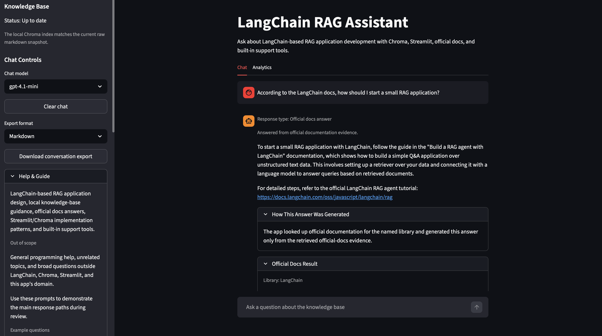
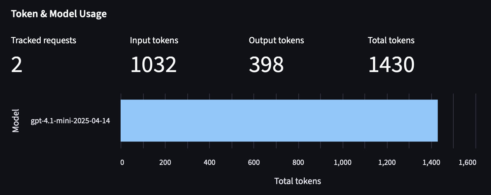
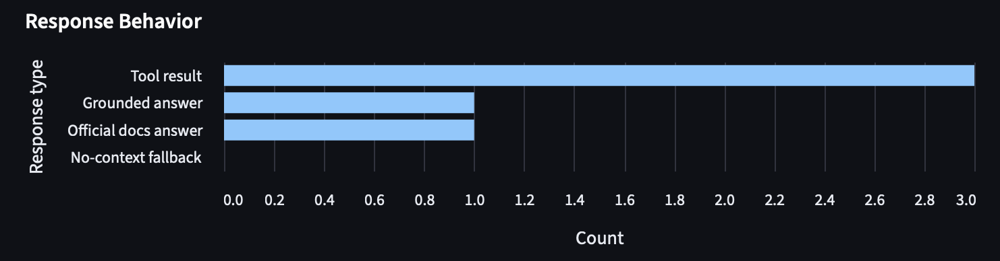

# LangChain RAG Assistant

Domain-focused Streamlit assistant for designing, debugging, and understanding LangChain-based RAG applications that use Chroma and OpenAI.



It combines:
- local knowledge-base RAG
- official-documentation answer routing
- deterministic tool calling
- Chroma vector search
- Streamlit chat and analytics UX
- runnable evaluation and MCP integrations

## Domain and Use Case

The assistant is specialized for **LangChain + Chroma + Streamlit RAG application development**.

It helps with:
- retrieval and chunking decisions
- Chroma persistence and rebuild workflows
- Streamlit chat and session-state patterns
- official documentation lookups for supported libraries
- practical tool-assisted tasks such as cost estimation and debugging guidance

It is not intended to be:
- a general chatbot
- a general coding assistant
- a broad AI tutor outside this domain

## Project Structure

```text
.
├── app.py                               # Streamlit entry point and top-level app orchestration
├── build_index.py                       # CLI for building and rebuilding the local Chroma index
├── official_docs_mcp_server.py          # Local MCP server exposing official-docs lookup tooling
├── project_tools_mcp_server.py          # Local MCP server exposing internal project search tooling
├── requirements.txt                     # Python dependency list
├── pytest.ini                           # pytest configuration for local test runs
├── data/                                # Local runtime and content assets
│   ├── raw/                             # Markdown knowledge-base documents used for indexing
│   ├── eval/                            # Evaluation cases for the custom RAG evaluation workflow
│   ├── official_docs/                   # Curated fallback manifest for official-docs lookups
│   └── chroma_db/                       # Persistent local Chroma database generated after indexing
├── docs/                                # Short project-specific usage notes
│   ├── evaluation.md                    # Evaluation workflow reference
│   └── project_tools_mcp_server.md      # Project-tools MCP server usage guide
├── rendering/                           # Streamlit rendering helpers, labels, charts, exports, and displays
├── services/                            # App service layer for validation, cached resources, and query execution
├── state/                               # Streamlit session-state initialization and key constants
├── ui/                                  # Sidebar and streaming-chat UI helpers
├── src/                                 # Application source code
│   ├── analytics.py                     # Analytics dashboard data-shaping helpers
│   ├── chains.py                        # Main request routing and answer orchestration
│   ├── config.py                        # Environment-backed application settings
│   ├── evaluation.py                    # Runnable evaluation workflow and report formatting
│   ├── kb_status.py                     # Knowledge-base freshness and manifest checks
│   ├── knowledge_base.py                # Markdown loading, chunking, and Chroma indexing
│   ├── llm_response_utils.py            # Shared LLM response text and usage extraction helpers
│   ├── logger.py                        # Application logging configuration
│   ├── rate_limit.py                    # Per-session request rate limiting logic
│   ├── retrieval.py                     # Query rewriting, filtering, and chunk retrieval logic
│   ├── schemas.py                       # Pydantic models for requests, results, and metadata
│   ├── tools.py                         # Deterministic built-in tool routing and implementations
│   ├── official_docs_*.py               # Official-docs adapters, transport, sources, and summary flow
│   └── official_docs_service.py         # Official-docs orchestration entry point
└── tests/                               # pytest coverage for app, retrieval, tools, evaluation, and MCP flows
    └── test_*.py                        # Focused tests for the implemented project modules
```

## Setup

### Prerequisites

- Python 3.11+
- an OpenAI API key

### Install dependencies

```bash
python -m venv .venv
source .venv/bin/activate
pip install -r requirements.txt
```

### Configure environment

Create a `.env` file based on `.env.example`, or export the required environment variables:

```bash
export OPENAI_API_KEY=your_api_key_here
```

Optional settings are available through environment variables such as:
- `DEFAULT_CHAT_MODEL`
- `EMBEDDING_MODEL`
- `CHROMA_PERSIST_DIR`
- `CHROMA_COLLECTION_NAME`

## Run the App

### 1. Build the local knowledge base

```bash
python build_index.py
```

### 2. Start the Streamlit app

```bash
streamlit run app.py
```

## Run Tests

```bash
pytest
```

## Run Evaluation

Run the custom evaluation workflow against the default dataset:

```bash
python -m src.evaluation
```

Run it against a specific dataset file:

```bash
python -m src.evaluation --cases data/eval/eval_cases.json
```

## Architecture Summary

The app is modularized so `app.py` stays mostly responsible for page setup,
tab orchestration, and high-level request flow. Supporting code is split across:

- `ui/` for sidebar controls, chat-input behavior, and streaming answer display
- `services/` for validation, cached OpenAI/Chroma resources, and query execution wrappers
- `state/` for Streamlit session-state initialization and shared keys
- `rendering/` for chat rendering, analytics rendering, labels, charts, structured displays, and exports
- `src/` for retrieval, routing, tools, official-docs lookup, evaluation, schemas, and persistence logic

The runtime behavior is organized around four main paths:

1. **Local KB RAG**
   - markdown corpus in `data/raw/`
   - OpenAI embeddings
   - Chroma vector store
   - query rewriting and metadata-aware retrieval in `src/retrieval.py`
   - grounded answer generation through LangChain/OpenAI with separated system, query, context, and source messages
   - streaming responses for grounded KB answers

2. **Official docs answer flow**
   - explicit docs-intent routing in `src/chains.py`
   - official-docs retrieval via supported MCP-compatible documentation sources where available
   - LangChain MCP lookup with deterministic local fallback when the remote MCP path is unavailable
   - controlled local fallback manifests for Streamlit and Chroma official docs
   - OpenAI official-docs lookup through the configured MCP adapter
   - answer generation constrained to retrieved official-docs evidence

3. **Built-in tools**
   - deterministic domain tools in `src/tools.py`
   - OpenAI cost estimation
   - stack-error diagnosis
   - retrieval-configuration recommendation

4. **UI, observability, and evaluation**
   - Streamlit chat + analytics tabs rendered through `rendering/` and `ui/`
   - session usage/cost tracking
   - KB freshness and rebuild visibility
   - grouped source display with chunk-index transparency
   - export flows
   - runnable evaluation workflow and dashboard interpretation in `src/evaluation.py` and `rendering/analytics_renderer.py`

## Core Features

### 1. RAG implementation

- Focused knowledge base built from project-specific markdown documents in `data/raw/`
- OpenAI embeddings + Chroma similarity search
- Chunking and chunk overlap during index build
- Query rewriting and metadata filter inference for more structured retrieval
- Grounded answers with visible sources and safe no-context fallback behavior
- Message-separated prompt construction for system rules, user query, retrieved context, and source metadata
- Streaming answer display for grounded KB responses

### 2. Tool calling

The app includes three domain-relevant built-in tools:

- `estimate_openai_cost`
- `diagnose_stack_error`
- `recommend_retrieval_config`

Each tool is relevant to building or debugging LangChain/Chroma/Streamlit RAG apps.

### 3. Domain specialization

- Narrow domain: LangChain-based RAG app development
- Focused prompts and domain-boundary behavior
- Focused local corpus and official-docs routing
- Relevant security measures:
  - domain-limited prompting
  - safe no-context fallback
  - input validation
  - rate limiting
  - API key management

### 4. Technical implementation

- LangChain used for model integration and retrieval orchestration
- Configured retry and timeout behavior for OpenAI chat calls
- Timeout-aware official-docs MCP transport and controlled unavailable-state handling
- Proper error handling and user-facing error messages
- Basic application logging for request handling, validation failures, rate-limit events, and backend errors
- Input validation for queries and tool inputs
- Rate limiting for chat requests
- API key management through settings / `.env`

### 5. User interface

- Streamlit interface with separate Chat and Analytics tabs
- Visible sources for grounded answers
- Source entries grouped by document, with relevant chunk indices shown inline
- readable tool-result presentation
- official-docs result display
- progress/status indicators during request handling and KB rebuilds

## Extra Features

These are additional implemented capabilities beyond the core app flow.

### Easy

- Conversation history
- Interactive help / chatbot guide
- Source citations in responses
- Conversation export functionality

### Medium

- Multi-model support within OpenAI chat models
- Token usage and cost display
- Tool-result visualization
- Conversation export in multiple formats: Markdown, JSON, CSV, PDF
- Advanced caching strategies for app resources and exports
- Use of MCP-compatible documentation sources for official-docs retrieval

### Hard

- Advanced analytics dashboard
- Tools implemented as MCP servers
- Runnable evaluation of the RAG system

## Analytics and Evaluation

### Analytics dashboard




The Analytics tab surfaces:
- response-type breakdowns
- readable token and cost totals
- model usage visibility
- KB freshness / rebuild state
- recent-turn diagnostics
- evaluation snapshot visibility
- evaluation interpretation with concise status text
- fallback-rate warnings when no-context fallback is common
- grouped source display behavior in the chat UI, including relevant chunk indices

### Evaluation workflow

The project includes a custom, runnable evaluation workflow in `src/evaluation.py`.

It evaluates:
- retrieval source recall
- keyword recall in answers
- context-usage expectation matching
- correct no-context fallback behavior
- source presence when context is used

The evaluation dataset lives in `data/eval/eval_cases.json`.

On the current curated evaluation set, the latest implementation reaches perfect
aggregate results for source recall, keyword recall, context-match rate,
no-context fallback behavior, and source presence. This is useful as a regression
signal, but it is still a small curated dataset and does not guarantee complete
real-world generalization.

The Analytics tab presents these results with metric tooltips, interpretation
text, and fallback warnings so the snapshot is easier to read without changing
the underlying evaluation scoring.

## MCP Work

The project includes both MCP consumption and MCP exposure:

- official-docs answer flow uses MCP-compatible documentation lookups where appropriate
- LangChain official-docs lookup can fall back to the curated local manifest when the remote MCP path is unavailable
- Streamlit and Chroma official-docs lookups use deterministic local fallback entries
- fallback coverage is limited to the entries present in `data/official_docs/source_manifest.json`
- local project tools are exposed through a project-tools MCP server

This keeps MCP support separate from the main chat flow architecture.

## Suggested Demo Flow

A quick way to explore the app is:

1. Build the KB with `python build_index.py`.
2. Start the app with `streamlit run app.py`.
3. Ask a grounded KB question:
   - `How should I persist and rebuild the Chroma index locally?`
4. Ask an official docs question:
   - `According to the LangChain docs, how should I start a small RAG application?`
5. Ask a tool question:
   - `Estimate OpenAI cost for model gpt-4.1-mini with 1000 input tokens, 500 output tokens, and 3 calls`
6. Ask an out-of-scope question to show the safe fallback:
   - `What is the capital of France?`
7. Open the Analytics tab and run the evaluation snapshot.
